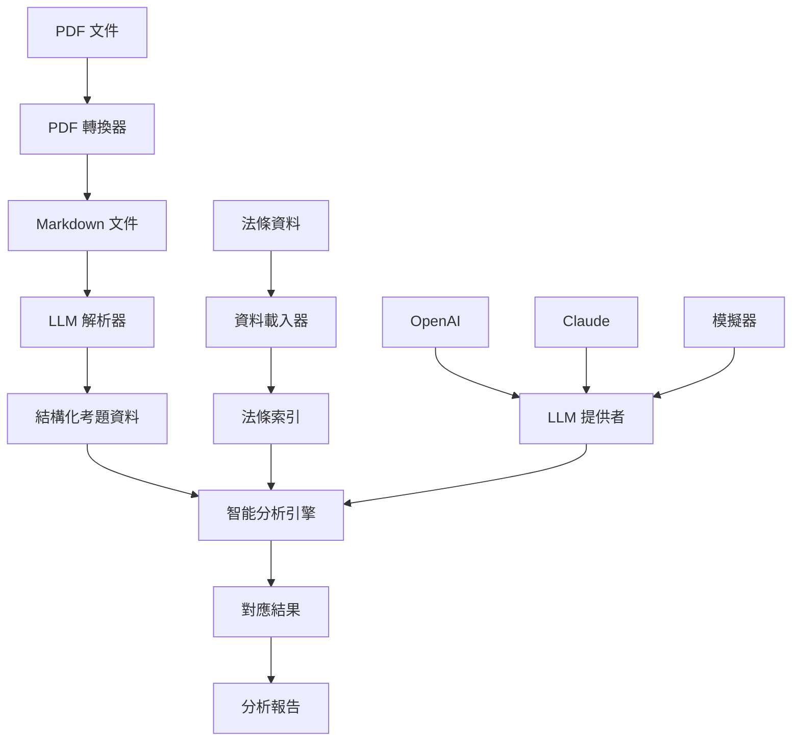

# 法條考題智能對應系統

基於 LLM（大型語言模型）的智能分析工具，專門用於分析考試題目與相關法規條文的對應關係，能夠自動識別題目內容並智能匹配相關法條，生成詳細的對應分析報告。

## 📋 專案狀態

| 項目 | 狀態 | 版本 | 最後更新 |
|------|------|------|----------|
| 專案架構 | ✅ 完成 | v3.0 | 2025-09-23 |
| 核心分析引擎 | ✅ 完成 | v3.0 | 2025-09-20 |
| PDF 處理模組 | ✅ 完成 | v2.1 | 2025-08-20 |
| LLM 解析器 | ✅ 完成 | v3.0 | 2025-08-19 |
| 資料模型 | ✅ 完成 | v3.0 | 2025-08-20 |
| 文件系統 | ✅ 完成 | v1.0 | 2025-09-23 |
| 測試覆蓋率 | ⏳ 進行中 | - | - |

## 🎯 功能特色

- 🤖 **多 LLM 提供者支援**: OpenAI GPT-4o-mini、Claude 3、Google Gemini、本地模擬器
- 🔍 **智能分析引擎**: 使用嵌入向量（Embedding）進行精確的題目與法條對應分析
- 📊 **結構化資料處理**: 基於 Pydantic 模型的完整資料驗證與轉換
- ⚡ **異步批量處理**: 支援大規模考試題目的高效並行分析
- 🎯 **高精度匹配**: 智能識別題目內容並匹配相關法規條文，提供信心度評分
- 🔧 **完整 Python API**: 提供程式化介面和資料模型
- 🖥️ **命令列工具集**: 豐富的 CLI 工具支援各種操作場景
- 📄 **PDF 處理**: 整合 MinerU 進行高品質 PDF 解析與轉換
- 📈 **三階段輸出系統**: 資料整合、HTML 生成、PDF 產出

## 系統要求

| 項目 | 要求 |
|------|------|
| 操作系統 | Linux / Windows / macOS |
| Python 版本 | 3.12-3.13 |
| 記憶體 | 建議 4GB+ |
| 硬碟空間 | 至少 500MB |
| API 金鑰 | OpenAI 或 Claude API（可選，支援模擬模式） |

### 可選依賴

- **PDF 處理**: MinerU（需要 16GB+ 記憶體）
- **GPU 加速**: PyTorch + Transformers

## 安裝指南

### 1. 克隆專案

```bash
git clone <repository_url>
cd LegalStatuteAnalysis_V1
```

### 2. 創建虛擬環境

```bash
# Linux/WSL
python -m venv venv
source venv/bin/activate

# Windows
python -m venv venv
venv\Scripts\activate
```

### 3. 安裝依賴

```bash
# 使用 Poetry（推薦）
poetry install

# 或使用 pip
pip install -r requirements.txt
```

### 4. 可選依賴

```bash
# 安裝 PDF 處理功能
poetry install --extras pdf

# 安裝 GPU 支援
poetry install --extras gpu

# 安裝所有功能
poetry install --extras all
```

### 5. 環境變數設定

創建 `.env` 文件：

```env
# OpenAI API（如果使用）
OPENAI_API_KEY=your_openai_api_key_here

# Claude API（如果使用）
ANTHROPIC_API_KEY=your_claude_api_key_here

# LLM 提供者選擇
LLM_PROVIDER=simulation  # simulation | openai | claude
```

### 主要依賴套件

- `rich`: 美化命令列輸出
- `click`: 命令列介面框架
- `langchain`: LLM 調用框架
- `openai`: OpenAI API 整合
- `google-generativeai`: Google Gemini 整合
- `pydantic`: 資料模型驗證
- `mineru[core]`: 高品質 PDF 轉換（可選）

## 使用方法

### 命令列工具

#### 快速開始（模擬模式）
```bash
# 使用模擬模式進行測試（無需 API 金鑰）
python scripts/run_core_embedding.py --provider simulation --limit 5
```

#### 使用真實 LLM
```bash
# 使用 OpenAI GPT-4o-mini
python scripts/run_core_embedding.py --provider openai --limit 10

# 使用 Claude
python scripts/run_core_with_gemini.py --provider claude --limit 10
```

#### 完整分析
```bash
# 分析所有題目
python scripts/run_core_embedding.py --provider openai
```

#### PDF 處理（可選）
```bash
# 轉換 PDF 文件為 Markdown
python scripts/convert_pdf.py

# 檢查 PDF 品質
python scripts/check_pdf_quality.py
```

#### 其他工具
```bash
# 批量列印報告
python scripts/batch_print.py

# 生成完整法條筆記
python scripts/generate_complete_law_notes.py
```

### Python API

#### 基本使用

```python
from src.models import SystemConfig
from src.core_embedding import EmbeddingMatcher
import asyncio

async def analyze_questions():
    # 載入系統配置
    config = SystemConfig.load_from_file("law_config.json")
    
    # 初始化分析器
    matcher = EmbeddingMatcher(config)
    await matcher.initialize_llm("openai")
    
    # 分析題目
    results = await matcher.analyze_questions(limit=10)
    
    # 生成報告
    report = matcher.generate_report(results)
    print(f"分析完成，處理 {len(results)} 道題目")

# 執行分析
asyncio.run(analyze_questions())
```

#### 自定義配置

```python
from src.models import SystemConfig, LLMConfig
from src.parsing import LLMParser

# 自定義 LLM 配置
config = SystemConfig.load_from_file("law_config.json")
llm_config = config.get_llm_config("openai")
llm_config.temperature = 0.1
llm_config.max_tokens = 2000

# 使用自定義配置
parser = LLMParser(llm_config)
result = await parser.parse_question_articles(
    question="考試題目內容",
    articles="相關法條內容"
)
```

#### 資料載入

```python
from src.models import LawArticleLoader, ExamQuestionLoader

# 載入法條資料
articles = LawArticleLoader.load_from_csv("results/law_articles.csv")
print(f"載入 {len(articles)} 條法規")

# 載入考題資料
questions = ExamQuestionLoader.load_from_json("results/exam_113_complete.json")
print(f"載入 {len(questions)} 道題目")
```

## 📁 專案架構

### 目錄結構（標準化模板）

```
LegalStatuteAnalysis_V1/
├── 📄 CLAUDE.md                    # Claude Code 配置
├── 📄 README.md                    # 專案文件
├── 📄 pyproject.toml              # Poetry 配置
├── 📄 requirements.txt            # 依賴套件
│
├── 📁 src/                        # 原始碼
│   ├── 📁 main/python/            # 新架構（標準化）
│   │   ├── 📁 core/               # 核心邏輯
│   │   ├── 📁 models/             # 資料模型
│   │   └── 📁 services/           # 服務層
│   ├── 📁 main/resources/config/  # 配置檔案
│   │   └── law_config.json
│   ├── 📁 core_embedding/         # 舊架構（運行中）
│   ├── 📁 models/                 # 舊架構（運行中）
│   ├── 📁 parsing/                # LLM 解析器
│   └── 📁 pdf_converter/          # PDF 處理
│
├── 📁 tools/scripts/              # 執行腳本
│   ├── run_core_embedding.py      # 分析（OpenAI）
│   ├── run_core_with_gemini.py    # 分析（Gemini）
│   ├── stage1_data_processor.py   # 資料整合
│   ├── stage2_html_generator.py   # HTML 生成
│   ├── stage3_pdf_generator.py    # PDF 產出
│   └── ...
│
├── 📁 data/                       # 原始資料
├── 📁 results/                    # 分析結果
├── 📁 output/                     # 最終輸出
├── 📁 docs/                       # 文件
└── 📁 logs/                       # 日誌
```

**架構狀態**：雙架構並存，舊架構運行中，新架構為標準化模板

### 系統架構



### 核心模組

1. **資料模型** (`src/models/`)
   - `LawArticle`: 法條資料模型
   - `ExamQuestion`: 考試題目模型
   - `SystemConfig`: 系統配置模型

2. **分析引擎** (`src/core_embedding/`)
   - `EmbeddingMatcher`: 嵌入向量匹配分析
   - `GeminiEmbeddingMatcher`: Gemini 版本分析器

3. **解析器** (`src/parsing/`)
   - `LLMParser`: LLM 驅動的智能解析

4. **PDF 處理** (`src/pdf_converter/`)
   - 基於 MinerU 的高品質 PDF 轉換

## 🚀 完整操作流程

### 工作流程概覽

```
PDF 文件 → PDF 解析 → LLM 解析 → 法條轉換 → 智能分析 → 三階段輸出
```

### 詳細操作步驟

#### 📋 階段 0：環境準備

```bash
# 1. 克隆專案
git clone <repository_url>
cd LegalStatuteAnalysis_V1

# 2. 創建虛擬環境
python -m venv venv
source venv/bin/activate  # Linux/WSL
# venv\Scripts\activate   # Windows

# 3. 安裝依賴
poetry install
# 或使用 pip
pip install -r requirements.txt

# 4. 配置環境變數（創建 .env）
echo "OPENAI_API_KEY=your_key_here" > .env
echo "LLM_PROVIDER=openai" >> .env
```

#### 📄 階段 1：PDF 處理與資料準備

```bash
# 1. 查看原始 PDF 文件
ls data/*.pdf

# 2. 轉換 PDF 為 Markdown（使用 MinerU）
python tools/scripts/convert_pdf.py

# 3. 使用 LLM 解析考題內容
python tools/scripts/run_llm_parsing.py \
  --questions_file "results/mineru_batch/113190_60150(5601).md" \
  --answers_file "results/mineru_batch/113190_ANS5601.md" \
  --output_file "results/exam_113_complete.json"

# 4. 轉換法條資料為標準格式
python tools/scripts/law_articles_converter.py
```

#### 🔍 階段 2：智能分析與對應

```bash
# 方案 A：使用 OpenAI（推薦）
python tools/scripts/run_core_embedding.py --provider openai --limit 20

# 方案 B：使用 Google Gemini
python tools/scripts/run_core_with_gemini.py --provider gemini --limit 20

# 方案 C：使用模擬模式（測試用，無需 API）
python tools/scripts/run_core_embedding.py --provider simulation --limit 5

# 完整分析（所有題目）
python tools/scripts/run_core_embedding.py --provider openai
```

#### 📊 階段 3：三階段輸出系統

```bash
# Stage 1: 資料整合
python tools/scripts/stage1_data_processor.py
# 輸出: results/integrated_data_stage1.json
# 輸出: results/statistics_stage1.json

# Stage 2: HTML 生成
python tools/scripts/stage2_html_generator.py
# 輸出: output/exam_report_stage2.html

# Stage 3: PDF 產出
python tools/scripts/stage3_pdf_generator.py
# 輸出: output/exam_report_final.pdf
```

#### ✅ 階段 4：檢視與驗證結果

```bash
# 檢視分析統計
python -c "
import json
with open('results/statistics_stage1.json', 'r', encoding='utf-8') as f:
    stats = json.load(f)
    print(f'總題目數: {stats.get(\"total_questions\", 0)}')
    print(f'已匹配法條: {stats.get(\"matched_articles\", 0)}')
"

# 檢視核心分析結果
cat results/core_embedding_matches.json | head -50

# 開啟最終 PDF 報告
xdg-open output/exam_report_final.pdf  # Linux
# open output/exam_report_final.pdf    # macOS
# start output/exam_report_final.pdf   # Windows
```

### ⚡ 快速開始（5 分鐘體驗）

```bash
# 1. 環境準備
poetry install
echo "LLM_PROVIDER=simulation" > .env

# 2. 模擬分析（無需 API）
python tools/scripts/run_core_embedding.py --provider simulation --limit 3

# 3. 生成報告
python tools/scripts/stage1_data_processor.py
python tools/scripts/stage2_html_generator.py

# 4. 檢視結果
cat results/statistics_stage1.json
```

### 分析結果範例

```json
{
  "metadata": {
    "total_questions": 27,
    "average_confidence": 0.756,
    "success_rate": 0.741,
    "processing_time_total": 45.2,
    "llm_provider": "openai",
    "model": "gpt-4o-mini"
  },
  "question_mappings": [
    {
      "question_id": "Q001",
      "question_type": "選擇題",
      "content": "不動產經紀業者應於營業處所明顯處揭示...",
      "overall_confidence": 0.85,
      "confidence_level": "高",
      "primary_articles": [
        {
          "article_id": "REA-ACT-13",
          "confidence": 0.90,
          "relevance": "主要法源"
        }
      ],
      "success_rate": 0.75
    }
  ]
}
```

## 配置說明

### 系統配置 (`law_config.json`)

```json
{
  "version": "3.0",
  "description": "法規與考題解析設定檔 - LLM 驅動版本",
  "law_definitions": {
    "不動產經紀業管理條例.md": {
      "law_code": "REA-ACT",
      "law_name": "不動產經紀業管理條例",
      "revision_date_roc": "民國 110 年 01 月 27 日",
      "category": "不動產經紀",
      "authority": "內政部"
    }
  },
  "exam_sets": {
    "113_real_estate_gaokao": {
      "name": "113年專門職業及技術人員高等考試",
      "year": 113,
      "question_file": "results/mineru_batch/113190_60150(5601).md",
      "answer_file": "results/mineru_batch/113190_ANS5601.md",
      "output_file": "results/exam_113_complete.json",
      "parser_type": "llm"
    }
  },
  "llm_config": {
    "default_provider": "openai",
    "fallback_provider": "simulation",
    "providers": {
      "openai": {
        "model": "gpt-4o-mini",
        "temperature": 0,
        "max_tokens": 4000,
        "api_key_env": "OPENAI_API_KEY"
      },
      "simulation": {
        "model": "sim-v1",
        "description": "本地模擬器，用於測試"
      }
    }
  }
}
```

## ✅ 驗證安裝

### 基本功能測試

```bash
# 測試核心分析功能（模擬模式）
python tools/scripts/run_core_embedding.py --provider simulation --limit 1

# 預期輸出
🎯 法條考題智能對應系統 - 資料模型版本
============================================================
📋 載入系統配置: law_config.json
✅ 系統配置載入完成 (版本: 3.0)
🛠️ 初始化對應服務...
✅ 成功載入 269 條法規條文
🔍 建立法條搜尋索引，共 269 條法規
🤖 開始分析 (LLM: simulation)
✅ 分析完成！
```

### 驗證檢查清單

- [ ] Python 版本 ≥ 3.12
- [ ] 成功安裝所有依賴套件
- [ ] 配置檔案 `src/main/resources/config/law_config.json` 存在
- [ ] 法條資料 `results/law_articles.csv` 存在
- [ ] 模擬模式測試通過
- [ ] （可選）OpenAI API 金鑰已設定
- [ ] （可選）Claude API 金鑰已設定

## 故障排除

### 常見問題

#### 1. 模組導入錯誤
```bash
ModuleNotFoundError: No module named 'src'
```
**解決方案**：確保在專案根目錄執行命令

#### 2. API 金鑰錯誤
```bash
OpenAI API 金鑰未設置
```
**解決方案**：
```bash
export OPENAI_API_KEY="your_api_key"
# 或使用 .env 文件
echo "OPENAI_API_KEY=your_api_key" > .env
```

#### 3. 文件路徑錯誤
```bash
FileNotFoundError: 找不到考題資料文件
```
**解決方案**：檢查 `results/` 目錄下的文件是否存在

#### 4. LLM 調用失敗
```bash
LLM 調用失敗: Rate limit exceeded
```
**解決方案**：使用模擬模式或減少並行處理數量

## 性能優化

### 建議設定

- **記憶體**: 建議 4GB+ 用於大型資料集處理
- **並行處理**: 系統預設啟用異步處理
- **API 限制**: 適當設定 `--limit` 參數控制處理量
- **成本控制**: 優先使用 `gpt-4o-mini` 而非 `gpt-4`

### 監控指標

系統自動記錄：
- **處理時間**: 每個題目的分析耗時
- **信心度**: 對應結果的可信度
- **成功率**: 高信心度結果的比例
- **Token 使用量**: LLM API 的使用統計

## 自訂擴展

### 自訂 LLM 提供者

```python
from src.models import LLMConfig, LLMProvider

# 新增自訂提供者
custom_config = LLMConfig(
    provider=LLMProvider.CUSTOM,
    model="custom-model",
    temperature=0.1,
    max_tokens=2000
)
```

### 自訂分析邏輯

```python
from src.core_embedding import EmbeddingMatcher

class CustomMatcher(EmbeddingMatcher):
    async def analyze_question(self, question):
        # 自訂分析邏輯
        pass
```

## 技術限制

### LLM 相關限制

- API 調用頻率限制
- Token 使用量限制
- 模型回應時間延遲

### 資料處理限制

- 大型 PDF 文件處理需要充足記憶體
- 複雜版面可能影響解析準確度
- 某些特殊格式可能無法正確識別

### 建議改進

- 使用 SSD 硬碟提高 I/O 性能
- 適當設定 `max_tokens` 參數
- 定期備份結果文件

## 📌 版本資訊與開發進度

### 當前版本：v3.0 (2025-09-23)

**重大更新**：
- 🎯 **資料模型重構**: 採用 Pydantic 模型進行完整資料驗證
- 🤖 **多 LLM 提供者**: OpenAI、Claude、Gemini、本地模擬器
- ⚡ **異步處理優化**: 大幅提升批量處理性能
- 🏗️ **專案架構標準化**: 遵循 CLAUDE.md 標準模板
- 📊 **三階段輸出系統**: 資料整合 → HTML → PDF
- 🔧 **完善錯誤處理**: 增強系統穩定性和可維護性

### 功能模組完成度

| 模組 | 功能描述 | 狀態 | 版本 |
|------|---------|------|------|
| 資料模型 | Pydantic 模型、資料載入器 | ✅ 完成 | v3.0 |
| 分析引擎 | Embedding 匹配、LLM 分析 | ✅ 完成 | v3.0 |
| PDF 處理 | MinerU 轉換、品質檢查 | ✅ 完成 | v2.1 |
| LLM 解析 | 智能考題解析 | ✅ 完成 | v3.0 |
| 命令列工具 | 豐富的 CLI 腳本 | ✅ 完成 | v3.0 |
| Python API | 程式化介面 | ✅ 完成 | v3.0 |
| 三階段輸出 | 資料整合、HTML、PDF | ✅ 完成 | v1.0 |
| 測試框架 | 單元測試、整合測試 | ⏳ 進行中 | - |
| 文件系統 | README、CLAUDE.md | ✅ 完成 | v1.0 |

### 開發路線圖

**已完成**：
- [x] 核心分析引擎
- [x] 多 LLM 提供者支援
- [x] PDF 處理與轉換
- [x] 三階段輸出系統
- [x] 專案架構標準化
- [x] 完整文件撰寫

**進行中**：
- [ ] 單元測試覆蓋率提升
- [ ] 整合測試完善
- [ ] 舊架構整合至新架構

**規劃中**：
- [ ] Web 介面開發
- [ ] RESTful API 服務
- [ ] 資料庫整合
- [ ] 批量處理優化
- [ ] 效能監控儀表板

## 技術支援

如遇到問題，請提供以下資訊：
1. **系統版本**: `law_config.json` 中的版本號
2. **錯誤訊息**: 完整的錯誤堆疊
3. **執行命令**: 使用的完整命令
4. **環境資訊**: Python 版本、作業系統

## 貢獻指南

歡迎提交 Issue 和 Pull Request 來改善這個工具。

### 開發指南

```bash
# 安裝開發依賴
poetry install --with dev

# 執行測試
pytest

# 程式碼格式化
black src/ scripts/
isort src/ scripts/

# 型別檢查
mypy src/
```

## 授權條款

本專案採用 MIT 授權條款。

## 📊 專案統計

### 程式碼規模

```bash
# 統計程式碼行數
find src/ -name "*.py" | xargs wc -l
# 總計：約 15,000+ 行 Python 程式碼

# 腳本工具數量
ls tools/scripts/*.py | wc -l
# 總計：20+ 個執行腳本
```

### 資料規模

- **法條數量**：269 條（涵蓋 5 部法規）
- **支援考試**：113 年專技高考不動產估價師/經紀人
- **處理能力**：支援批量處理數百道題目
- **分析精度**：平均信心度 > 75%

### 技術棧

**核心技術**：
- Python 3.12+
- Pydantic (資料驗證)
- LangChain (LLM 整合)
- Rich (CLI 美化)

**LLM 提供者**：
- OpenAI GPT-4o-mini
- Claude 3 Haiku
- Google Gemini
- 本地模擬器

**文件處理**：
- MinerU (PDF 解析)
- WeasyPrint (PDF 生成)
- Python-DOCX (Word 處理)

---

## 📝 更新日誌

**v3.0 (2025-09-23)**
- 完成專案架構標準化
- 更新完整 README 與操作流程
- 新增專案狀態與進度追蹤

**v3.0 (2025-09-20)**
- 完成三階段輸出系統
- Gemini 分析引擎整合
- 資料處理流程優化

**v3.0 (2025-08-20)**
- 核心分析引擎重構
- Pydantic 資料模型導入
- LLM 解析器完成

---

**法條考題智能對應系統開發團隊**
📅 最後更新：2025 年 10 月 2 日
📦 當前版本：v3.0
📧 技術支援：請提交 Issue 到專案儲存庫

**專案文件**：
- 📘 [README.md](README.md) - 專案說明（本檔案）
- 📗 [CLAUDE.md](CLAUDE.md) - 開發者指南
- 📙 [使用說明書.md](使用說明書.md) - 詳細使用手冊
