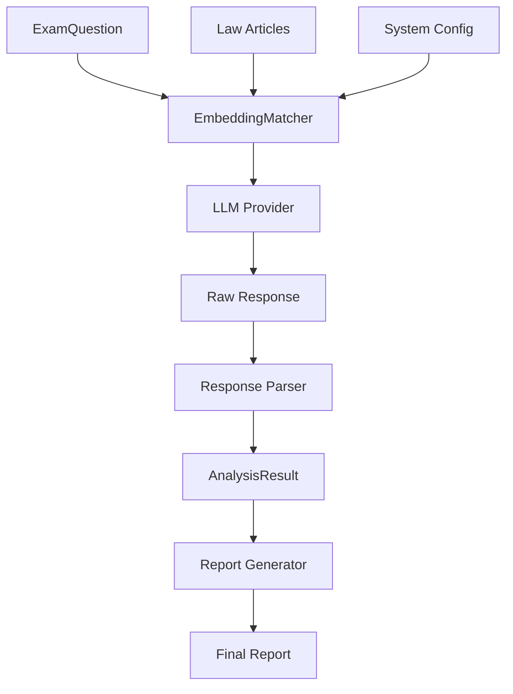

# 核心引擎 API 文檔 - LegalStatuteAnalysis_V1

> **文件版本**：1.0
> **最後更新**：2025-09-23
> **模組路徑**：`src.main.python.core`
> **狀態**：活躍

---

## 📋 概覽

核心引擎模組實現 LLM 驅動的智能分析功能，採用統一介面設計，消除不同 LLM 提供者間的特殊情況處理。遵循 Linus "實用主義" 原則，專注於解決實際的法條匹配問題。

---

## 🧠 主要組件

### EmbeddingMatcher - 核心分析引擎

**用途：** 統一的 LLM 分析介面，支援多種 LLM 提供者

```python
from src.main.python.core import EmbeddingMatcher
from src.main.python.models import SystemConfig, LLMProvider

class EmbeddingMatcher:
    """
    核心分析引擎 - 統一介面，無特殊情況

    設計原則：
    - 單一職責：只負責問題與法條的匹配分析
    - 無特殊情況：所有 LLM 提供者使用相同邏輯
    - 簡潔介面：提供最少但足夠的方法
    """

    def __init__(self, config: SystemConfig):
        """初始化分析引擎"""

    async def initialize_llm(self, provider_name: str) -> None:
        """初始化指定的 LLM 提供者"""

    async def analyze_question(self, question: ExamQuestion) -> Optional[AnalysisResult]:
        """分析單一問題 - 核心方法"""

    async def analyze_questions(self,
                               questions: List[ExamQuestion],
                               limit: Optional[int] = None) -> List[AnalysisResult]:
        """批量分析問題"""

    def generate_report(self, results: List[AnalysisResult]) -> Dict[str, Any]:
        """產生分析報告"""
```

**初始化範例：**

```python
from src.main.python.models import SystemConfig
from src.main.python.core import EmbeddingMatcher

# 載入配置
config = SystemConfig.load_from_file("src/main/resources/config/law_config.json")

# 初始化分析器
matcher = EmbeddingMatcher(config)

# 設定 LLM 提供者
await matcher.initialize_llm("openai")  # 或 "claude", "simulation"
```

---

### 核心分析方法

#### analyze_question() - 單一問題分析

**簽名：**
```python
async def analyze_question(self, question: ExamQuestion) -> Optional[AnalysisResult]:
```

**參數：**
- `question: ExamQuestion` - 待分析的考試題目

**回傳：**
- `Optional[AnalysisResult]` - 分析結果，失敗時回傳 None

**使用範例：**

```python
from src.main.python.models import ExamQuestion, QuestionType

# 建立問題
question = ExamQuestion(
    question_id="Q001",
    content="不動產經紀業者應於營業處所明顯處揭示哪些資訊？",
    question_type=QuestionType.MULTIPLE_CHOICE,
    options=["A. 營業執照", "B. 經紀人證書", "C. 收費標準", "D. 以上皆是"]
)

# 分析問題
result = await matcher.analyze_question(question)

if result:
    print(f"信心度: {result.confidence:.2f}")
    print(f"主要法條: {result.primary_article}")
    print(f"匹配法條: {result.matched_articles}")
```

#### analyze_questions() - 批量分析

**簽名：**
```python
async def analyze_questions(self,
                           questions: List[ExamQuestion],
                           limit: Optional[int] = None) -> List[AnalysisResult]:
```

**參數：**
- `questions: List[ExamQuestion]` - 問題列表
- `limit: Optional[int]` - 限制處理數量，None 表示處理全部

**回傳：**
- `List[AnalysisResult]` - 分析結果列表

**使用範例：**

```python
# 載入問題
questions = ExamQuestionLoader.load_from_json("results/exam_113_complete.json")

# 批量分析（限制前10題）
results = await matcher.analyze_questions(questions, limit=10)

print(f"成功分析 {len(results)} 道題目")
```

#### generate_report() - 產生報告

**簽名：**
```python
def generate_report(self, results: List[AnalysisResult]) -> Dict[str, Any]:
```

**參數：**
- `results: List[AnalysisResult]` - 分析結果列表

**回傳：**
- `Dict[str, Any]` - 結構化報告資料

**報告格式：**

```python
{
    "metadata": {
        "total_questions": 27,
        "successful_analyses": 20,
        "average_confidence": 0.756,
        "success_rate": 0.741,
        "processing_time_total": 45.2,
        "llm_provider": "openai",
        "model": "gpt-4o-mini"
    },
    "question_mappings": [
        {
            "question_id": "Q001",
            "confidence": 0.85,
            "confidence_level": "高",
            "primary_article": "REA-ACT-13",
            "matched_articles": ["REA-ACT-13", "REA-ACT-14"],
            "processing_time": 2.3
        }
        # ... 更多結果
    ],
    "statistics": {
        "confidence_distribution": {
            "極高": 5,
            "高": 8,
            "中等": 4,
            "低": 2,
            "極低": 1
        },
        "most_referenced_articles": [
            {"article_id": "REA-ACT-13", "count": 12},
            {"article_id": "REA-ACT-14", "count": 8}
        ]
    }
}
```

---

### GeminiEmbeddingMatcher - Gemini 特化版本

**用途：** 專門用於 Google Gemini API 的 embedding 匹配器

```python
from src.main.python.core import GeminiEmbeddingMatcher

class GeminiEmbeddingMatcher:
    """
    Gemini 特化匹配器 - 使用 embedding 相似度比對

    特色：
    - 使用 Gemini embedding-001 模型
    - 支援向量化相似度計算
    - 提供詳細的匹配分數
    """

    def __init__(self, gemini_api_key: str, embedding_model: str = "models/embedding-001"):
        """初始化 Gemini 匹配器"""

    def load_law_articles(self, articles_path: str) -> None:
        """載入法條資料"""

    async def generate_embeddings(self, texts: List[str]) -> np.ndarray:
        """產生文字嵌入向量"""

    async def match_question_to_articles(self, question_content: str) -> MatchResult:
        """匹配問題到法條"""

    async def match_options_to_articles(self, question_id: str, options: Dict[str, str]) -> List[OptionMatchResult]:
        """匹配選項到法條"""
```

**使用範例：**

```python
import os
from src.main.python.core import GeminiEmbeddingMatcher

# 初始化 Gemini 匹配器
api_key = os.getenv("GEMINI_API_KEY")
gemini_matcher = GeminiEmbeddingMatcher(api_key)

# 載入法條資料
gemini_matcher.load_law_articles("results/law_articles.csv")

# 匹配問題
question_content = "不動產經紀業者應於營業處所明顯處揭示哪些資訊？"
match_result = await gemini_matcher.match_question_to_articles(question_content)

print(f"匹配到 {len(match_result.matched_articles)} 條相關法條")
for article in match_result.matched_articles:
    print(f"法條: {article['article_id']}, 相似度: {article['similarity']:.3f}")
```

---

## 🔧 LLM 提供者介面

### 統一 LLM 介面

所有 LLM 提供者都實現相同的介面，確保無特殊情況處理：

```python
from abc import ABC, abstractmethod

class LLMProvider(ABC):
    """LLM 提供者統一介面"""

    @abstractmethod
    async def analyze(self, prompt: str) -> str:
        """分析方法 - 所有提供者必須實現"""
        pass

    @abstractmethod
    def get_model_info(self) -> Dict[str, Any]:
        """取得模型資訊"""
        pass
```

### 具體實現

#### OpenAIProvider

```python
class OpenAIProvider(LLMProvider):
    """OpenAI GPT 系列提供者"""

    def __init__(self, config: LLMConfig):
        self.client = openai.AsyncOpenAI(api_key=os.getenv(config.api_key_env))
        self.model = config.model
        self.temperature = config.temperature
        self.max_tokens = config.max_tokens

    async def analyze(self, prompt: str) -> str:
        """使用 GPT 模型分析"""
        response = await self.client.chat.completions.create(
            model=self.model,
            messages=[{"role": "user", "content": prompt}],
            temperature=self.temperature,
            max_tokens=self.max_tokens
        )
        return response.choices[0].message.content
```

#### ClaudeProvider

```python
class ClaudeProvider(LLMProvider):
    """Anthropic Claude 提供者"""

    async def analyze(self, prompt: str) -> str:
        """使用 Claude 模型分析"""
        # Claude API 實現
        pass
```

#### SimulationProvider

```python
class SimulationProvider(LLMProvider):
    """模擬提供者 - 用於測試和開發"""

    async def analyze(self, prompt: str) -> str:
        """回傳模擬的分析結果"""
        return self._generate_mock_response(prompt)

    def _generate_mock_response(self, prompt: str) -> str:
        """產生模擬回應 - 用於測試"""
        return json.dumps({
            "confidence": 0.75,
            "matched_articles": ["REA-ACT-13"],
            "reasoning": "模擬分析結果：根據題目內容判斷..."
        }, ensure_ascii=False)
```

---

## 📊 分析流程

### 完整分析管道



### 內部處理邏輯

```python
async def analyze_question(self, question: ExamQuestion) -> Optional[AnalysisResult]:
    """分析問題的內部流程"""

    # 1. 建構提示詞
    prompt = self._build_analysis_prompt(question)

    # 2. 調用 LLM
    try:
        raw_response = await self.llm_provider.analyze(prompt)
    except Exception as e:
        logger.error(f"LLM analysis failed: {e}")
        return None

    # 3. 解析回應
    try:
        analysis_data = self._parse_llm_response(raw_response)
    except Exception as e:
        logger.error(f"Response parsing failed: {e}")
        return None

    # 4. 建構結果
    result = AnalysisResult(
        question_id=question.question_id,
        confidence=analysis_data["confidence"],
        confidence_level=ConfidenceLevel.from_score(analysis_data["confidence"]),
        matched_articles=analysis_data["matched_articles"],
        primary_article=analysis_data.get("primary_article"),
        reasoning=analysis_data.get("reasoning"),
        llm_provider=self.current_provider,
        raw_response=raw_response
    )

    return result
```

---

## ⚙️ 配置與初始化

### 系統配置範例

```json
{
  "llm_config": {
    "default_provider": "openai",
    "fallback_provider": "simulation",
    "providers": {
      "openai": {
        "model": "gpt-4o-mini",
        "temperature": 0,
        "max_tokens": 4000,
        "api_key_env": "OPENAI_API_KEY"
      },
      "claude": {
        "model": "claude-3-haiku-20240307",
        "temperature": 0,
        "max_tokens": 4000,
        "api_key_env": "ANTHROPIC_API_KEY"
      },
      "simulation": {
        "model": "sim-v1",
        "description": "本地模擬器，用於測試"
      }
    }
  }
}
```

### 初始化最佳實踐

```python
async def initialize_analysis_system():
    """初始化分析系統的推薦方式"""

    # 1. 載入配置
    config = SystemConfig.load_from_file("src/main/resources/config/law_config.json")

    # 2. 建立分析器
    matcher = EmbeddingMatcher(config)

    # 3. 嘗試初始化主要提供者
    try:
        await matcher.initialize_llm(config.llm_config["default_provider"])
        logger.info(f"✅ 成功初始化 {config.llm_config['default_provider']} 提供者")
    except Exception as e:
        logger.warning(f"主要提供者初始化失敗: {e}")

        # 4. 降級到後備提供者
        fallback_provider = config.llm_config["fallback_provider"]
        await matcher.initialize_llm(fallback_provider)
        logger.info(f"✅ 使用後備提供者: {fallback_provider}")

    return matcher
```

---

## 🚨 錯誤處理

### 錯誤類型

```python
class AnalysisError(Exception):
    """分析過程中的錯誤"""
    pass

class LLMProviderError(AnalysisError):
    """LLM 提供者錯誤"""
    pass

class ConfigurationError(AnalysisError):
    """配置錯誤"""
    pass
```

### 錯誤處理策略

```python
async def safe_analyze_question(matcher: EmbeddingMatcher,
                               question: ExamQuestion) -> Optional[AnalysisResult]:
    """安全的問題分析 - Linus 式錯誤處理：快速失敗，詳細記錄"""

    try:
        return await matcher.analyze_question(question)
    except LLMProviderError as e:
        logger.error(f"LLM 提供者錯誤 - Question {question.question_id}: {e}")
        return None
    except ConfigurationError as e:
        logger.error(f"配置錯誤 - Question {question.question_id}: {e}")
        return None
    except Exception as e:
        logger.error(f"未知錯誤 - Question {question.question_id}: {e}")
        return None
```

---

## 📈 性能考量

### 批量處理優化

```python
async def analyze_questions_optimized(self,
                                    questions: List[ExamQuestion],
                                    batch_size: int = 5) -> List[AnalysisResult]:
    """優化的批量分析 - 簡單的並行處理"""

    results = []

    for i in range(0, len(questions), batch_size):
        batch = questions[i:i + batch_size]

        # 並行處理批次
        batch_tasks = [self.analyze_question(q) for q in batch]
        batch_results = await asyncio.gather(*batch_tasks, return_exceptions=True)

        # 過濾有效結果
        valid_results = [r for r in batch_results if isinstance(r, AnalysisResult)]
        results.extend(valid_results)

        # 簡單的速率限制
        if i + batch_size < len(questions):
            await asyncio.sleep(1)  # 防止 API 速率限制

    return results
```

---

## 🎯 使用模式總結

### 基本使用流程

```python
# 1. 初始化
config = SystemConfig.load_from_file("config/law_config.json")
matcher = EmbeddingMatcher(config)
await matcher.initialize_llm("openai")

# 2. 分析單一問題
question = ExamQuestion(...)
result = await matcher.analyze_question(question)

# 3. 批量分析
questions = ExamQuestionLoader.load_from_json("exam_data.json")
results = await matcher.analyze_questions(questions, limit=10)

# 4. 產生報告
report = matcher.generate_report(results)
print(f"平均信心度: {report['metadata']['average_confidence']:.3f}")
```

### 設計原則體現

**Linus 的實用主義：**
- ✅ 解決實際問題：法條與考題的精確匹配
- ✅ 避免過度設計：統一的 LLM 介面，無複雜的抽象層
- ✅ 簡單可靠：錯誤快速失敗，不嘗試複雜恢復

**好品味的體現：**
- ✅ 消除特殊情況：所有 LLM 提供者使用相同處理邏輯
- ✅ 單一職責：每個類別都有明確、單一的責任
- ✅ 清晰介面：方法簽名直觀，參數數量合理

---

## 📚 相關文檔

- [資料模型 API](./models-api.md) - 資料結構說明
- [開發指南](../dev/development-guide.md) - 開發原則和流程
- [快速入門](../user/quick-start.md) - 實際使用範例