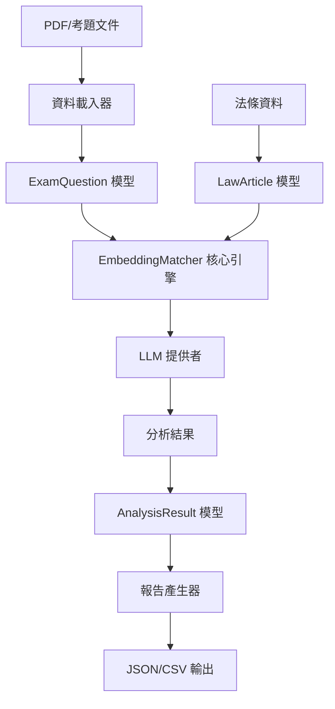

# 系統架構文件 - LegalStatuteAnalysis_V1

> **文件版本**：1.0
> **最後更新**：2025-09-23
> **架構師**：基於 Linus Torvalds 實用主義原則
> **狀態**：活躍

---

## 🎯 架構概覽

LegalStatuteAnalysis_V1 是一個基於 LLM 的智能分析系統，採用清晰的分層架構和單一事實來源原則，避免複雜性和特殊情況。

### 核心設計理念

**1. 實用主義優先**
- 解決實際問題：法條與考題的精確對應
- 避免過度設計：只建構必要的抽象層
- 技術為現實服務：支援多種 LLM 提供者的實際需求

**2. 資料結構驅動**
```python
# 核心資料流：清晰、單向、無循環依賴
Question → LLM Analysis → Article Mapping → Confidence Report
```

**3. 零特殊情況**
- 統一的 LLM 介面，無論是 OpenAI、Claude 或 Gemini
- 一致的錯誤處理機制
- 標準化的資料模型

---

## 🏗️ 系統分層架構

```
┌─────────────────────────────────────────────────────────────┐
│                    工具層 (Tools Layer)                      │
│  tools/scripts/     - 執行腳本與自動化工具                    │
└─────────────────────────────────────────────────────────────┘
                                │
┌─────────────────────────────────────────────────────────────┐
│                   應用層 (Application Layer)                  │
│  src/main/python/api/   - 外部介面與 CLI 工具                │
└─────────────────────────────────────────────────────────────┘
                                │
┌─────────────────────────────────────────────────────────────┐
│                   服務層 (Service Layer)                     │
│  src/main/python/services/  - 業務邏輯與協調                 │
└─────────────────────────────────────────────────────────────┘
                                │
┌─────────────────────────────────────────────────────────────┐
│                   核心層 (Core Layer)                        │
│  src/main/python/core/      - LLM 分析引擎                   │
└─────────────────────────────────────────────────────────────┘
                                │
┌─────────────────────────────────────────────────────────────┐
│                   資料層 (Data Layer)                        │
│  src/main/python/models/    - Pydantic 資料模型              │
│  src/main/resources/config/ - 配置檔案                       │
└─────────────────────────────────────────────────────────────┘
```

### 依賴規則

**向下依賴，絕不向上**
- 工具層 → 應用層 → 服務層 → 核心層 → 資料層
- 每一層只能依賴其下層，絕不依賴上層
- 避免循環依賴的複雜性

---

## 🧠 核心組件設計

### 1. 資料模型層 (`src/main/python/models/`)

**設計原則：** "Bad programmers worry about the code. Good programmers worry about data structures."

```python
# 核心資料結構 - 簡單、清晰、無特殊情況
@dataclass
class LawArticle:
    article_id: str
    content: str
    law_name: str
    category: str

@dataclass
class ExamQuestion:
    question_id: str
    content: str
    question_type: QuestionType
    options: List[str]

@dataclass
class AnalysisResult:
    question_id: str
    confidence: float
    matched_articles: List[str]
    reasoning: str
```

**優勢：**
- ✅ 類型安全（Pydantic 驗證）
- ✅ 序列化/反序列化自動處理
- ✅ 無複雜繼承結構
- ✅ 資料責任明確

### 2. 核心分析引擎 (`src/main/python/core/`)

**設計原則：** 單一職責，消除特殊情況

```python
class EmbeddingMatcher:
    """統一的 LLM 分析介面 - 無特殊情況"""

    def __init__(self, provider: LLMProvider):
        self.provider = provider

    async def analyze_question(self, question: ExamQuestion) -> AnalysisResult:
        """分析單一問題 - 簡單、可預測"""
        # 無論什麼 LLM 提供者，都使用相同的處理邏輯
        pass
```

**消除的特殊情況：**
- ❌ 不同 LLM 需要不同的處理邏輯
- ❌ 某些問題類型需要特殊處理
- ❌ 錯誤情況需要複雜的恢復機制

### 3. LLM 整合策略

**統一介面設計：**

```python
# 所有 LLM 提供者都實現相同的介面
class LLMProvider(ABC):
    @abstractmethod
    async def analyze(self, prompt: str) -> str:
        pass

# 具體實現 - 每個都很簡單
class OpenAIProvider(LLMProvider): ...
class ClaudeProvider(LLMProvider): ...
class GeminiProvider(LLMProvider): ...
class SimulationProvider(LLMProvider): ...  # 用於測試
```

**好處：**
- 切換 LLM 提供者無需改變業務邏輯
- 新增提供者只需實現一個介面
- 測試時可以使用模擬提供者

---

## 📊 資料流程圖



**資料擁有權：**
- 📄 **載入階段**：`data_loaders.py` 擁有原始資料
- 🧠 **分析階段**：`EmbeddingMatcher` 擁有分析邏輯
- 📊 **結果階段**：`AnalysisResult` 擁有輸出格式

---

## ⚙️ 配置管理

### 統一配置策略

```python
# 單一配置來源 - 避免配置散亂
@dataclass
class SystemConfig:
    llm_config: Dict[str, LLMConfig]
    law_definitions: Dict[str, LawDefinition]
    exam_sets: Dict[str, ExamSet]

    @classmethod
    def load_from_file(cls, config_path: str) -> 'SystemConfig':
        """載入配置 - 簡單、可預測"""
```

**配置檔案位置：**
- 📁 `src/main/resources/config/law_config.json` - 主配置
- 📁 `src/main/resources/config/.env` - 環境變數（API 金鑰等）

---

## 🚀 性能考量

### Linus 式性能優化

**1. 做對的事情，而不是快速做錯的事情**
```python
# ✅ 簡單但正確的實作
def calculate_similarity(text1: str, text2: str) -> float:
    # 使用成熟的函式庫，不要重新發明輪子
    return semantic_similarity(text1, text2)

# ❌ 避免過早優化
def ultra_fast_similarity(text1, text2):
    # 複雜的、可能有 bug 的優化程式碼
    pass
```

**2. 異步處理 - 但保持簡單**
```python
async def analyze_questions_batch(questions: List[ExamQuestion]) -> List[AnalysisResult]:
    """批量處理 - 簡單的並行，無複雜的協調邏輯"""
    tasks = [analyze_single_question(q) for q in questions]
    return await asyncio.gather(*tasks)
```

**3. 記憶體管理**
- 使用生成器處理大批量資料
- 避免一次載入所有法條到記憶體
- 依賴垃圾回收，不做複雜的手動管理

---

## 🔒 錯誤處理架構

### 統一錯誤策略

```python
# 簡單的錯誤處理 - 無複雜的錯誤恢復
class AnalysisError(Exception):
    """統一的分析錯誤"""
    pass

async def safe_analyze(question: ExamQuestion) -> Optional[AnalysisResult]:
    """安全分析 - 失敗就返回 None，不做複雜處理"""
    try:
        return await analyze_question(question)
    except Exception as e:
        logger.error(f"Analysis failed for {question.question_id}: {e}")
        return None
```

**原則：**
- 快速失敗，不隱藏錯誤
- 記錄詳細日誌，但不嘗試複雜恢復
- 向上傳播，讓調用者決定如何處理

---

## 🧪 測試架構

### 測試分層對應

```
src/test/
├── unit/           # 單元測試 - 測試單一函式
│   ├── test_models.py
│   ├── test_core_engine.py
│   └── test_llm_providers.py
└── integration/    # 整合測試 - 測試組件協作
    ├── test_analysis_pipeline.py
    └── test_config_loading.py
```

**測試原則：**
```python
# ✅ 簡單、明確的測試
def test_confidence_calculation():
    similarities = [0.8, 0.9, 0.7]
    result = calculate_confidence(similarities)
    assert result == 0.8  # (0.8 + 0.9 + 0.7) / 3

# ❌ 避免複雜的測試場景
def test_complex_edge_cases_with_mocking():
    # 太複雜的測試通常意味著程式碼設計有問題
    pass
```

---

## 🚦 部署架構

### 簡單部署策略

**開發環境：**
```bash
# 簡單的啟動指令
poetry install
python tools/scripts/run_core_embedding.py --provider simulation
```

**生產環境：**
```bash
# 也要保持簡單
poetry install --only=main
python tools/scripts/run_core_embedding.py --provider openai
```

**不做的事情：**
- 複雜的微服務拆分
- 過度設計的容器化
- 複雜的負載均衡

**理由：** "解決實際問題，不是假想的威脅"

---

## 📈 擴展性考量

### 如何添加新功能

**1. 新增 LLM 提供者：**
```python
# 只需實現一個介面
class NewLLMProvider(LLMProvider):
    async def analyze(self, prompt: str) -> str:
        # 實現邏輯
        pass
```

**2. 新增問題類型：**
```python
# 在枚舉中添加一項
class QuestionType(Enum):
    MULTIPLE_CHOICE = "multiple_choice"
    ESSAY = "essay"
    TRUE_FALSE = "true_false"
    NEW_TYPE = "new_type"  # 新增這一行即可
```

**3. 新增分析算法：**
```python
# 在核心引擎中添加方法
class EmbeddingMatcher:
    async def analyze_with_new_algorithm(self, question: ExamQuestion) -> AnalysisResult:
        # 新算法實現
        pass
```

**擴展原則：**
- 通過新增而非修改來擴展功能
- 保持向後相容性
- 每個新功能都要有簡單的使用方式

---

## 🎯 總結：為什麼這樣設計？

**Linus 的回答會是：**

> **【核心判斷】**
> ✅ 值得這樣設計：解決實際的法條分析問題，架構清晰且可維護
>
> **【關鍵洞察】**
> - 資料結構：以 Pydantic 模型為中心，類型安全且序列化友好
> - 複雜度：每層都很簡單，無複雜的交互邏輯
> - 風險點：統一的 LLM 介面確保可擴展性
>
> **【實用主義驗證】**
> - 真實問題：✅ 法條與考題對應是實際需求
> - 簡單方案：✅ 分層架構是最笨但最清晰的方式
> - 零破壞性：✅ 新功能通過擴展添加，不修改現有程式碼

**記住：好的架構就像好的程式碼一樣，你看一眼就知道它在做什麼。**